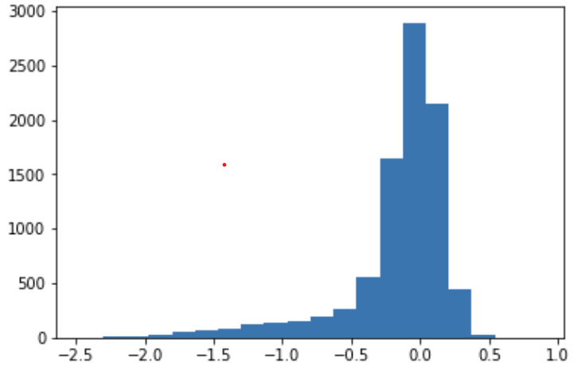
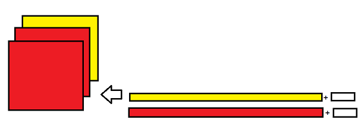

# seq2img


## Usage 
⁕ Build up required environment first.

```
python train.py -m vit # --train ./split/train.txt --val ./split/val.txt
python evaluate -i ./models/resnet.pt # evaluate the model on test set (default: ./split/test.txt)
python predict.py -d ./split/test.txt -m ./models/vit_0.pt # can get predicted values
```

## library info
python 3.6

```
torchvision 0.10
torch 1.9
```

## Dataset

#### split the original data into train,validation, and test data.
```bash
python split.py --origin_data ./data/data.txt --split_folder ./split
```
Also, you can download split data in [here](https://www.dropbox.com/sh/0c3l0xv59kamnwr/AAC0GWkDkpx4jUFHEhH04wQza?dl=0)  
x: [attr1:[...],attr2:[...]]
e.g.,)   
train label's distribution (bins = 20)


x: attr1, attr2 (14719:121*121+78)  
processing: 2 seq. to 3 channel (attr1,attr2,attr2)(3x122x121)  


#### data total 
23550 item 
#### split info  


|    train   |validation        |   test |
|------:|:-----------|--------:|
|     8831| 7359| 7360|


path: ./split/{train|val|test}.txt (※: there's no header)


## Model

### types 


|    model   |alias| |
|------:|:-----------|--------:|
|     ResNet [1]| resnet| |
|     resnext50 [2]| resnext| |
|     Shuffle_v2 [3]| shufflenet| |
|     SqueezeNet1 [4]| squeezenet| |
|     MNASNet [5]| mnasnet| |
|     MobileNet v3 small [6] | mobilenet| |
|     Vision transformer [7]| vit| |

## REFERENCES

[1] He, Kaiming, et al. "Deep residual learning for image recognition." Proceedings of the IEEE conference on computer vision and pattern recognition. 2016.  
[2] Xie, Saining, et al. "Aggregated residual transformations for deep neural networks." Proceedings of the IEEE conference on computer vision and pattern recognition. 2017.  
[3] Ma, Ningning, et al. "Shufflenet v2: Practical guidelines for efficient cnn architecture design." Proceedings of the European conference on computer vision (ECCV). 2018.  
[4] Iandola, Forrest N., et al. "SqueezeNet: AlexNet-level accuracy with 50x fewer parameters and< 0.5 MB model size." arXiv preprint arXiv:1602.07360 (2016).  
[5] Tan, Mingxing, et al. "Mnasnet: Platform-aware neural architecture search for mobile." Proceedings of the IEEE/CVF Conference on Computer Vision and Pattern Recognition. 2019.  
[6] Howard, Andrew, et al. "Searching for mobilenetv3." Proceedings of the IEEE/CVF International Conference on Computer Vision. 2019.  
[7] Dosovitskiy, Alexey, et al. "An image is worth 16x16 words: Transformers for image recognition at scale." arXiv preprint arXiv:2010.11929 (2020).  

